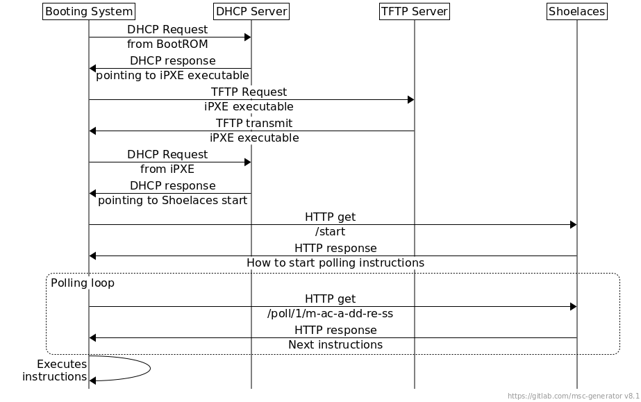

# **Shoelaces:** lightweight and painless server bootstrapping

**Shoelaces** serves [iPXE](https://ipxe.org/) boot scripts,
[cloud-init](http://cloud-init.org/) configuration, and any other configuration
files over HTTP to hardware or virtual machines booting over iPXE. It also does
a few other things to make it easier to manage your server deployments:

* Has a simple but **nice UI** to show the current configuration, and history of
  servers that booted.
* Uses simple **Go based template language** to handle more complex configurations.
* Allows specifying the **boot entry point** for a given server based on its
  **IP** address or **DNS PTR** record.
* Supports the notion of **environments** for _Development_ and _Production_
  environment configurations, while trying to minimize template duplication.
* Puts unknown servers into iPXE script boot **retry loop**, while at the same
  time **showing them in the UI** allowing the user to select a specific boot
  configuration.

## How it works

As soon as Shoelaces starts, the service will be patiently waiting for servers
to boot. If no servers are detected, you'll simply see a spinner in the web UI,
as can be seen in the screenshot.


The URL `localhost:8081` will actually point to wherever you are running your
Shoelaces instance. It must be reachable by the booting hosts.

The following picture shows a high level overview of how a server notifies
Shoelaces that it's ready for booting.



In this graph we can see that as soon as the server boots using network boot, we
instruct the machine to switch to an [iPXE](https://ipxe.org/) executable. We do this
because we need to be able to make HTTP requests to Shoelaces, and regular
[PXE](https://en.wikipedia.org/wiki/Preboot_Execution_Environment) does not
support that protocol.

So, when a server boots, the
[DHCP](https://en.wikipedia.org/wiki/Dynamic_Host_Configuration_Protocol) server
will instruct it to retrieve an iPXE executable from a
[TFTP](https://en.wikipedia.org/wiki/Trivial_File_Transfer_Protocol) server.
When the host receives the iPXE executable, it will chainload into it and trigger a new
DHCP request. Finally, the server will detect that the request comes from an
iPXE executable, allowing it to respond with an HTTP URL. This URL, as you may have
guessed, will be pointing to Shoelaces.

If there was no automated installation configured for the booting server, you'll
be able to select an option to bootstrap it in the Shoelaces UI.


A couple of things can be said about this screenshot:

* When you select a task, a bunch of input boxes for filling with parameters
  will appear (in the picture, they are *release* and *hostname*). The
  parameters to complete will be dynamically loaded from the chosen task
  template.

* Hosts send their MAC address when they contact Shoelaces. From the HTTP
  request Shoelaces will extract the source IP and perform a reverse DNS lookup.
  If the DNS query is successful, the resolved hostname will be shown in the web
  UI. If no hostname was resolved, Shoelaces will show just the MAC and the IP.

## Setting up

### Building Shoelaces

At the moment a binary package is not provided. The only way of running
Shoelaces is to compile it from source. Refer to the Go Programming
Language [Getting Started](https://golang.org/doc/install) guide to learn
how to compile Shoelaces.

Once that you have configured your Go, you can get and compile Shoelaces by
running:

    $ go get github.com/thousandeyes/shoelaces
    $ cd $GOPATH/src/github.com/thousandeyes/shoelaces
    $ go build

### Running Shoelaces

You can quickly try Shoelaces after compiling it by using the example configuration file:

    ./shoelaces -config configs/shoelaces.conf

Head to [localhost:8081](http://localhost:8081) to checkout Shoelaces' frontend.

### Shoelaces configuration file

Shoelaces accepts several parameters:

* `config`: the path to a configuration file.
* `data-dir`: the path to the root directory with the templates. It's advised to
  manage the templates in a VCS, such as a git repository. Refer to the [example
  data directory](configs/data-dir/) for more information.
* `debug`: enable debug messages.
* `domain`: the domain Shoelaces is going to be listening on.
* `mappings-file`: the path to the YAML mappings file, relative to the `data-dir` parameter.
* `port`: the port Shoelaces will listen on.
* `template-extension`: the filename extension for the templates. The default is
  `.slc`, so you can just stick with that.

The parameters can be specified in a configuration file, as environment
variables or, of course, as parameters when running the Shoelaces binary.

Refer to the [example config file](configs/shoelaces.conf) for more information.

### Extra requirements

Along with your **Shoelaces** installation, you will need a LAN segment with
working [TFTP](https://en.wikipedia.org/wiki/Trivial_File_Transfer_Protocol) and
[DHCP](https://en.wikipedia.org/wiki/Dynamic_Host_Configuration_Protocol)
servers. Any TFTP server should work. The DHCP server will need to be able to
match the `user-class` of the boot client. In our example the configuration is
for the widely used [ISC DHCP Server](https://www.isc.org/downloads/dhcp/).
Shoelaces will happily coexist with the TFTP and DHCP servers on the same host.
The server you are going to bootstrap needs to be capable of booting over the
network using
[PXE](https://en.wikipedia.org/wiki/Preboot_Execution_Environment).

#### TFTP

The TFTP server is only used to chainload the iPXE boot loader, so setting it up
in `read-only` mode is sufficient. The loader we use (`undionly.kpxe`) can be
downloaded from the [ipxe.org](http://ipxe.org/howto/chainloading) website.

It is also possible to compile your own iPXE executable in order to customize the
booting of your servers. For example, it's useful to [add your own SSL
certificates](http://ipxe.org/crypto#trusted_root_certificates) in case you want
to boot using HTTPS.

#### DHCP

Drop this config in your **ISC DHCP** server, replacing the relevant sections
with your TFTP and Shoelaces server addresses.

```txt
# dhcp.conf
next-server <your-tftp-server>;
if exists user-class and option user-class = "iPXE" {
  filename "http://<shoelaces-server>/start";
} else {
  filename "undionly.kpxe";
}
```

For **dnsmasq** (v2.53 or above) you can add this to its existing config, e.g. by
putting it in `dnsmasq.d/ipxe.conf`:

```txt
dhcp-match=set:ipxe,175 # iPXE sends a 175 option.
dhcp-boot=tag:!ipxe,undionly.kpxe
dhcp-boot=http://<shoelaces-server>/start
```

The **${netX/mac:hexhyp}** strings represents the MAC address of the booting
host. iPXE will be in charge of replacing that string for the actual value.

*Note*: In case you are using a DHCP server that does not have this level of
flexibility for configuring it, you can always re-compile the iPXE executable for
[breaking the loop](https://ipxe.org/howto/chainloading#breaking_the_loop_with_an_embedded_script).

## Script discoverability

The purpose of Shoelaces is automation. The less input it receives from the
user, the better. When a server boots, Shoelaces needs the user to select the
booting script to use, but there are certain cases where we can automate even
that.

* You can preload Shoelaces with mappings from **IPs to boot scripts**.
* You can preload Shoelaces with mappings from **hostnames to boot scripts**. When a
  server boots, Shoelaces will make a reverse DNS query to get the hostname for
  the IP that made the request, and will match the result to a series of regular
  expressions.

Shoelaces will read these mappings from a YAML file that can be passed as a
program parameter. Refer to the [example mappings
file](configs/data-dir/mappings.yaml) for more information.

## Environments

Shoelaces supports the notion of environments a.k.a. *env overrides*.
Consider the following `data-dir` directory structure:

```txt
├── cloud-config
│   └── coreos-cloud-config.yaml.slc
├── env_overrides
|   └── testing
|       └─── cloud-config
|            └── coreos-cloud-config.yaml.slc
├── ipxe
│   ├── coreos.ipxe.slc
│   └── ubuntu-minimal.ipxe.slc
├── mappings.yaml
├── preseed
│   └── common.preseed.slc
└── static
    ├── bootstrap.sh
    └── rc.local-bootstrap
```

In this case, hosts that have `environment: testing` set in the `mappings.yaml`
will be assigned the `testing` environment and they'll use the
`coreos-cloud-config.yaml.slc` template from the `env_overrides/testing
directory`, while the rest of the templates will be served from the base
directory. Everything except `mappings.yaml` can be put in `env_overrides/$env`
preserving the path.

The way this works, considering that **Shoelaces** is mostly stateless, is by
setting different `baseURL` depending on the environment set. Normal requests
would get `baseURL` set to `http://$shoelaces_host:$port` while an environment
request will have `http://$shoelaces_host:$port/env/$environment_name/`

*CORNER CASES*: It is not possible to boot a host in a non default environment
unless there is a main iPXE script in the respective override directory. This
means /ipxemenu will only present default and non-default **iPXE** entry points,
and if you have a template that's included later in the boot process as an
override you won't be able to select it.

## Contributing

Contributions to Shoelaces are very welcome! Take into account the following
guidelines:

* [File an issue](https://github.com/thousandeyes/shoelaces/issues) if you find
  a bug or, even better, contribute with a pull request.
* We have a bunch of integration tests that can be run by executing `make test`.
  Ensure that all test pass before submitting your pull request.
